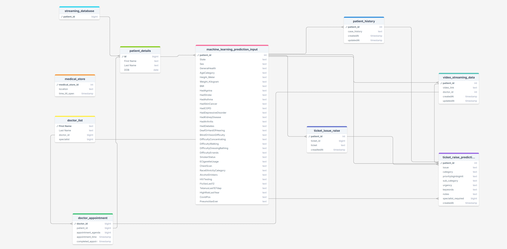

# Healthcare Ticket Classification

## Overview
This project is an end-to-end solution for healthcare ticket classification and house premises treatment. The system uses machine learning models to classify healthcare-related tickets and perform associated tasks, such as slot booking, meeting room creation, medical history management, and video analysis.

The project is designed to work efficiently in a scalable environment, leveraging technologies like Docker, MongoDB, Kafka and AWS for seamless integration and real-time processing.

---

## Features
- **Ticket Classification**: Automatically classifies healthcare tickets into predefined categories.
- **Slot Booking**: Automates slot booking for consultations.
- **Medical History Management**: Manages and processes patients' medical history.
- **Meeting Room Creation**: Creates virtual meeting rooms for consultations.
- **Video Analysis**: Analyzes videos for healthcare-specific insights.
- **Scalable and Modular Design**: Built using Docker and Docker Compose for portability and scalability.

---

## Folder Structure
- **data/**: Contains raw and processed datasets.
- **database/**: Stores database configurations and schema files.
- **logs/**: Contains log files for debugging and monitoring.
- **research/**: Includes notebooks and experiments for model training and evaluation.
- **src/**: Source code directory.
  - **components/**: Core components for business logic (e.g., video analysis, classification, slot booking).
  - **constants/**: Contains constant variables used across the project.
  - **entities/**: Data models and schemas.
  - **exceptions/**: Custom exception handling.
  - **logger/**: Logging setup and utilities.
  - **utils/**: Helper utilities and common functions.
- **venv/**: Python virtual environment.
- **app.py**: Main application entry point.
- **main.py**: Alternative script for starting the project.
- **requirements.txt**: List of Python dependencies.
- **Dockerfile**: Instructions for building the Docker image.
- **docker-compose.yml**: Configuration for running the project with Docker Compose.
- **README.md**: Documentation for the project.
- **README.Docker.md**: Docker-specific setup instructions.
- **credentials.json**: Contains credentials for accessing external APIs or databases.

---

## Prerequisites
1. **Python**: Install Python 3.9 or later.
2. **Docker**: Ensure Docker and Docker Compose are installed.
3. **Environment Variables**: Define required environment variables in the `.env` file.

---

## Installation
1. Clone the repository:
   ```bash
   git clone https://github.com/your-repo/healthcare-ticket-classification.git
   cd healthcare-ticket-classification
   ```
2. Create a virtual environment and install dependencies:
   ```bash
   python -m venv venv
   source venv/bin/activate  # On Windows: venv\Scripts\activate
   pip install -r requirements.txt
   ```
3. Build and start the Docker containers:
   ```bash
   docker-compose up --build
   ```

---

## Usage
1. Start the application:
   ```bash
   python app.py
   ```
2. Access the web application at `http://localhost:8501`.

---

## Key Components
### **Ticket Classification**
- Uses machine learning models to classify healthcare tickets into categories.
- Code: `src/components/classification_process.py`
- In this section the ticket is classified using specific field of classification, as we all know the LLM model hallucinate, so tried to narrow down the classification options to minimum level.

### **Architecture Diagram**
- The architecture of the Healthcare Ticket Classification system is illustrated in the following diagram:


### **Slot Booking**
- Automates the process of booking consultation slots.
- Code: `src/components/slot_booking.py`

### **Patient-Doctor Interaction and Medication Delivery Process**
- The process of patient-doctor interaction and medication delivery is illustrated in the following diagram:


### **Medical History**
- Extracts and processes medical history data.
- Code: `src/components/medical_history.py`

### **Video Analysis**
- Analyzes videos for specific healthcare tasks.
- Code: `src/components/analysing_videos.py`

### **Data Processing in S3 Datalake**
- The data processing workflow in the S3 datalake is depicted in the following diagram:


### **SQL Schema**
- Desinged some sql shcema for better understanding of the data flow and understanding of data:

---

## Logging
Logs are stored in the `logs/` directory for debugging and monitoring purposes. Customize logging behavior in `src/logger`.

---

## Contributing
Contributions are welcome! Please fork the repository and submit a pull request with detailed information about the changes.

---

## License
This project is licensed under the [MIT License](LICENSE).
